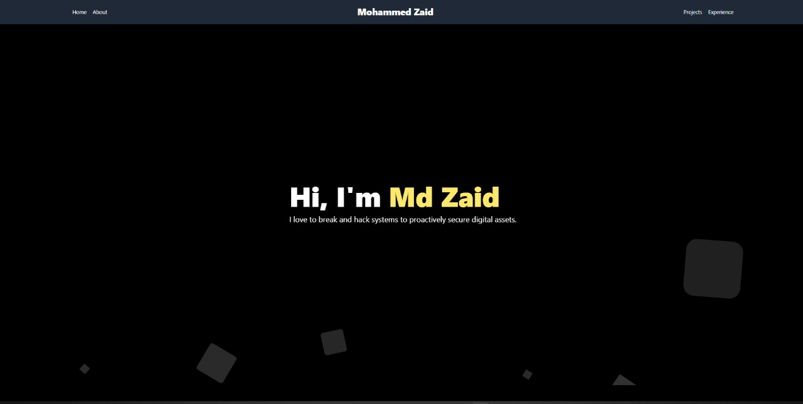
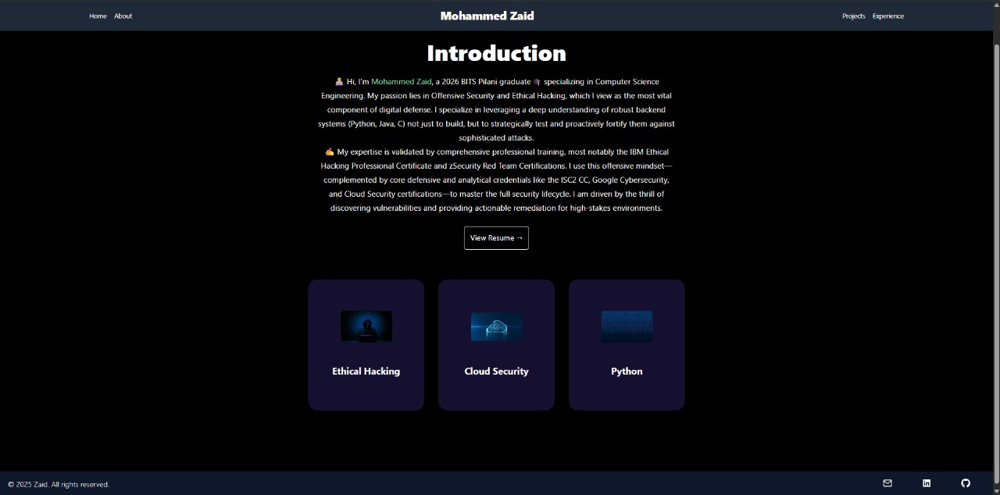
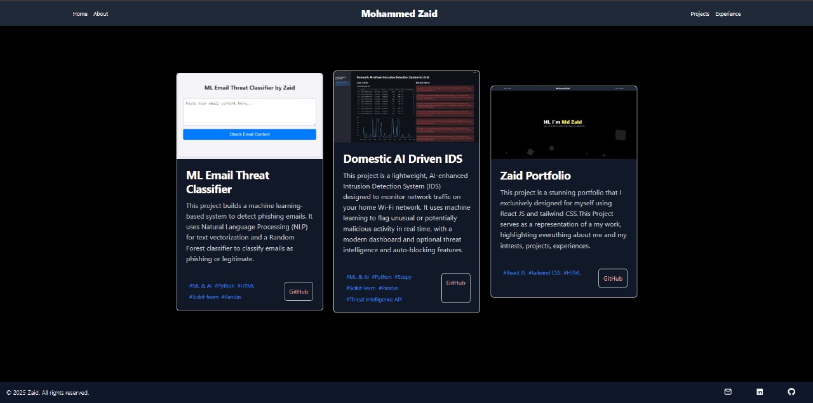
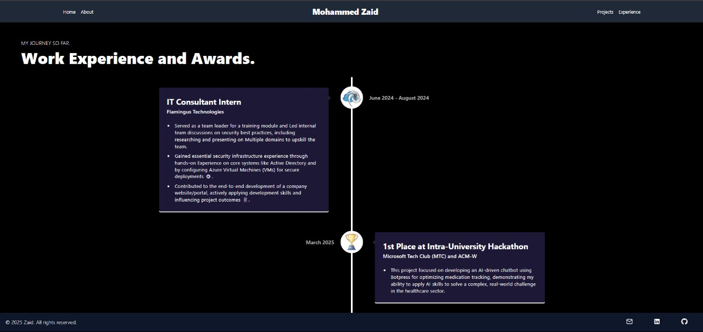

# **🧑‍💻 Personal Portfolio Website**

Live Demo: https://your-portfolio-link.vercel.app

This project is a modern, responsive personal portfolio website built entirely using React.js and Tailwind CSS.
It showcases my skills, projects, experience, and interests in a sleek and interactive interface, serving as a central hub for everything about me — from my technical journey to my creative work.

---

📸 Preview






---

## **Installation**

### **1. Clone the Repository**
```bash
git clone https://github.com/zaidzyy/zaid-portfolio.git
cd zaid-portfolio


```

## **Usage**

### **Step 1: Load Dependencies**

```bash
npm i
```

### **Start the Site**

```bash
npm start
```
Now go to http://localhost:3000/ to visit your app

---


